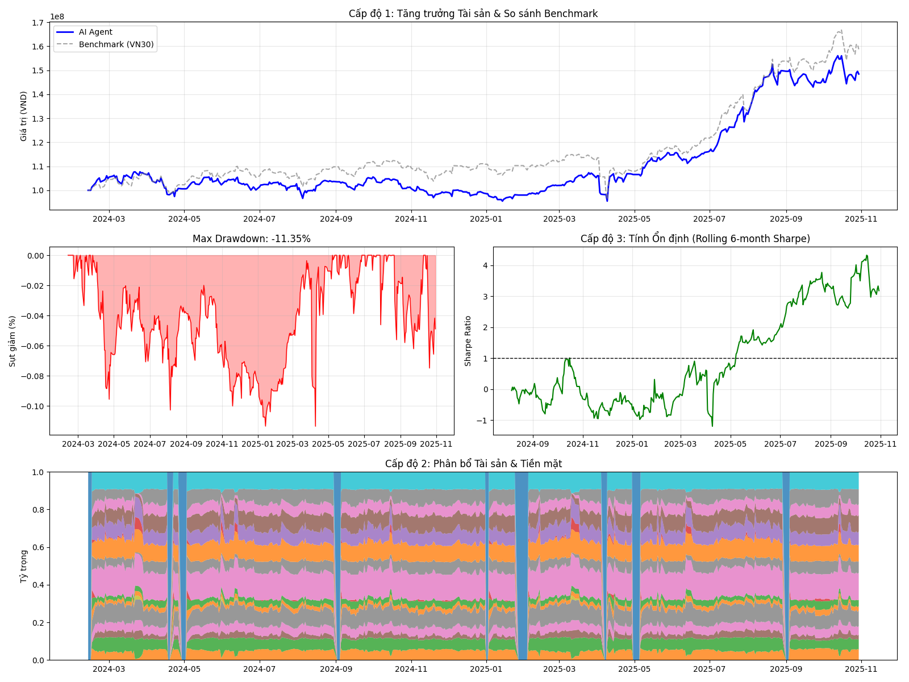

# 📈 Tối ưu Danh mục Đầu tư bằng Deep Reinforcement Learning (PPO + Transformer)

[](https://www.python.org/)
[](https://pytorch.org/)
[](https://stable-baselines3.readthedocs.io/)
[](https://gymnasium.farama.org/)

Hệ thống tối ưu hóa danh mục đầu tư tự động (Automated Asset Allocation) trên thị trường chứng khoán Việt Nam (VN30). Dự án ứng dụng thuật toán **Proximal Policy Optimization (PPO)** kết hợp kiến trúc **Transformer** để nắm bắt các biến động phi tuyến của thị trường và tối đa hóa lợi nhuận điều chỉnh theo rủi ro (Risk-adjusted Returns).

## 🚀 Tính năng Cốt lõi & Điểm nhấn Kỹ thuật

* **Kiến trúc SOTA (State-of-the-Art):** Thay vì dùng LSTM/GRU truyền thống, mô hình sử dụng **Transformer Encoder** làm Policy Network để trích xuất đặc trưng chuỗi thời gian dài hạn, giải quyết triệt để bài toán vanishing gradient.
* **Tư duy Quản trị Rủi ro (Risk-first Mindset):** Hàm phần thưởng (Reward Function) không chỉ tối ưu lợi nhuận thuần, mà được thiết kế để **phạt nặng các mức sụt giảm tài sản (Max Drawdown)**, mô phỏng chính xác khẩu vị rủi ro của các quỹ đầu tư thực tế.
* **Môi trường Giao dịch Thực tế (Custom Gym Env):** Tính toán chi tiết phí giao dịch (Transaction Costs) và độ trượt giá (Slippage), loại bỏ ảo tưởng về lợi nhuận (overfitting) thường gặp trong các mô hình backtest thông thường.
* **Vectorized Backtesting:** Đánh giá toàn diện chiến lược trên tập dữ liệu Out-of-sample (2023 - 2025) với các chỉ số chuyên sâu của ngành Quant (Sharpe, Calmar, MDD).

---

## 🛠️ Kiến trúc Hệ thống (System Architecture)

Mô hình hoạt động dựa trên vòng lặp Markov Decision Process (MDP) giữa Agent và Market Environment:

1. **State (Input):** Tensor 3 chiều `(Window Size × Max Assets × Features)`. Các features bao gồm cấu trúc OHLCV của 30 mã cổ phiếu trong 30 phiên giao dịch gần nhất.
2. **Neural Network (PPO Agent):**
   * **Feature Extractor:** Mạng Multi-Head Self-Attention (Transformer) trích xuất đặc trưng xu hướng dòng tiền.
   * **Policy Network (Actor):** Xuất ra vector $a_t$ đại diện cho tỷ trọng phân bổ vốn (Portfolio Weights), thỏa mãn điều kiện $\sum a_t = 1$ và $a_t \ge 0$ (Chỉ đánh Long, không bán khống).
   * **Value Network (Critic):** Đánh giá chất lượng của State hiện tại để tính toán Generalized Advantage Estimation (GAE).
3. **Reward Signal:** Log-return của danh mục trừ đi chi phí tái cân bằng (Rebalancing costs) và hàm phạt Drawdown.

---

## 📊 Kết quả Backtest & Phân tích Chiến lược

Mô hình được huấn luyện 2,000,000 timesteps và kiểm định trên tập Out-of-Sample (01/01/2023 - 10/11/2025). 

### Bảng Chỉ số Hiệu suất (Performance Metrics)

| Chỉ tiêu Đo lường | AI Agent (PPO + Transformer) | Benchmark (Hold VN30) | Equal-Weight (Chia đều) |
| :--- | :---: | :---: | :---: |
| **Lợi nhuận năm (ARR)** | `24.88%` | 29.76% | 25.38% |
| **Max Drawdown (MDD)** | **-11.35%** | -16.22% | -18.09% |
| **Sharpe Ratio** | **1.323** | 1.500 | 1.340 |
| **Calmar Ratio** | **2.193** | 1.835 | 1.403 |

> 💡 **Quantitative Insight:** 
> Dù Lợi nhuận tuyệt đối (ARR) của AI Agent thấp hơn Benchmark, nhưng đây là một **Chiến lược Phòng thủ (Defensive Strategy)** cực kỳ thành công. Bằng cách chủ động hạ tỷ trọng các tài sản rủi ro trong giai đoạn thị trường sập, AI đã khống chế mức sụt giảm tối đa (Max Drawdown) chỉ ở mức **-11.35%** (an toàn hơn rất nhiều so với mức -16.22% của thị trường chung). Điều này dẫn đến chỉ số **Calmar Ratio (Lợi nhuận / Rủi ro) cao nhất**, chứng minh hệ thống có khả năng bảo toàn vốn xuất sắc trong điều kiện thị trường khắc nghiệt.



---

## 📂 Cấu trúc Repository

```text
├── data/                   # Dữ liệu chứng khoán VN30 (Raw & Processed Data)
├── envs/                   # Môi trường Gymnasium tùy chỉnh cho bài toán Trading
│   └── environment.py
├── models/                 # Định nghĩa kiến trúc PPO Actor-Critic và Transformer
│   └── transformer_policy.py
├── notebooks/              # Jupyter Notebooks EDA và Data Preprocessing
├── train.py                # Pipeline huấn luyện mô hình RL
├── backtest.py             # Vectorized Backtester & Metrics Calculation
├── requirements.txt        # Dependencies
└── README.md
